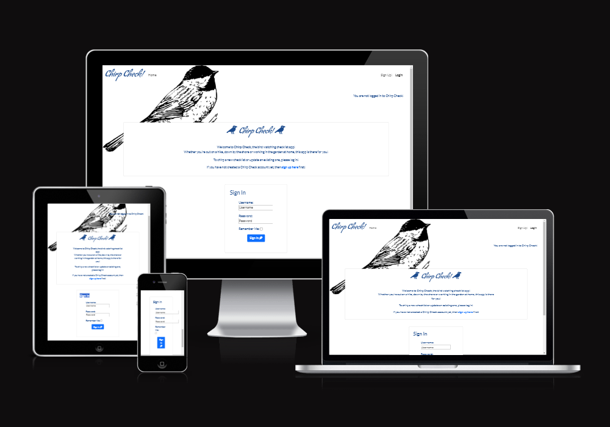
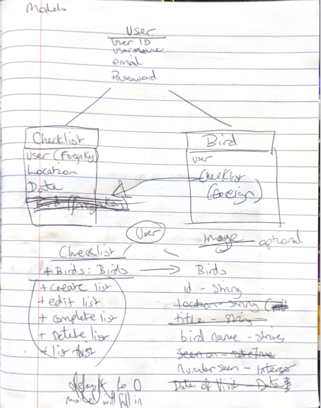
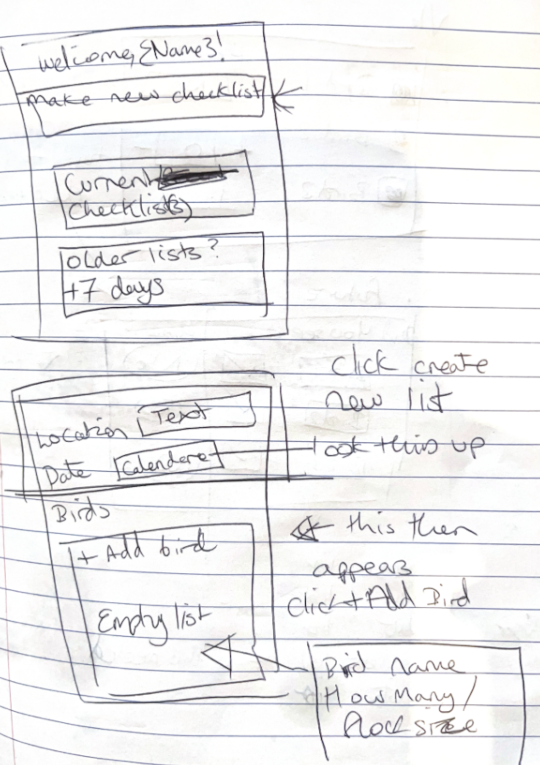
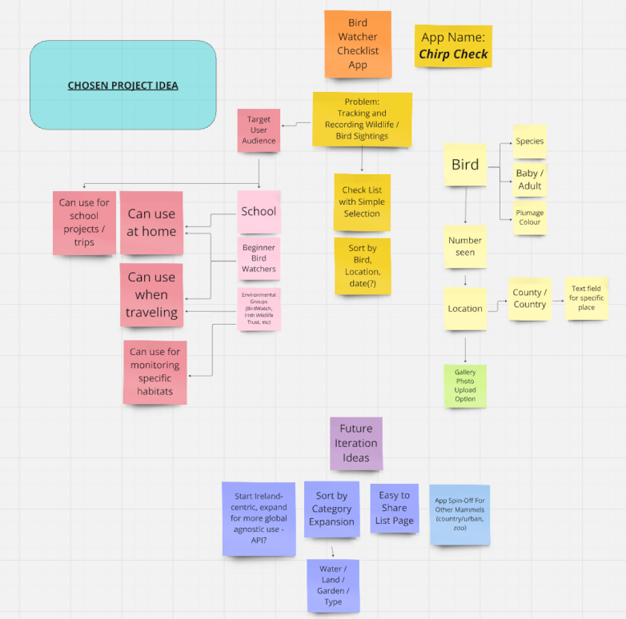
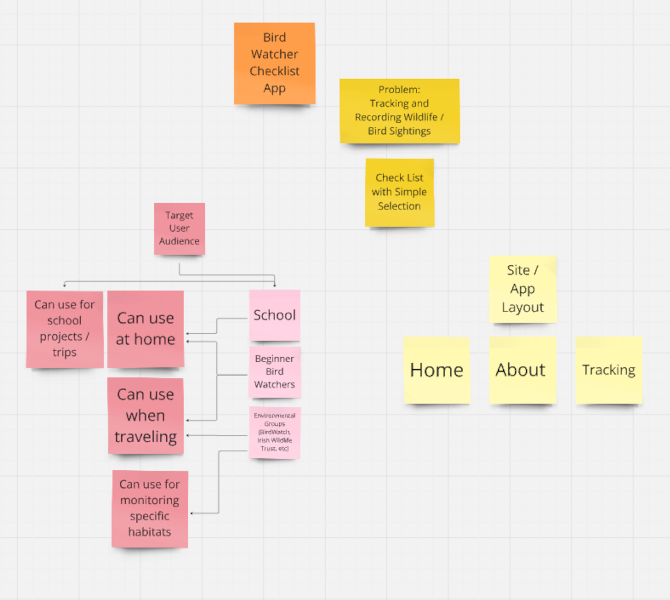
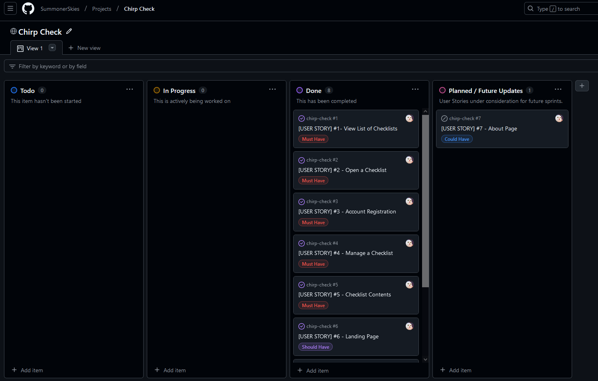

# 

# Welcome to Chirp Check!

## The Bird Watching Checklist
### Chirp Check is a light-weight checklist app that allows you to track how many birds you see at a given location. Whether you're out on a hike, down by the shore or working in the garden at home, this app is there for you!

The responsive website app allows registered users to log in and create new checklists, or update an existing one with birds they have or have not seen.

# [Link to Deployed Site](https://chirp-check-ddace85f08c7.herokuapp.com/)  

This project has been created as the final portfolio project for Code Institute's 16 week fullstack developer bootcamp.  

Built by Emma Sadler.

---

# Table of Contents  

 1. [UX](#ux)
 2. [Agile Development](#agile-development)
 3. [Features Implemented](#features-implemented)  
 4. [Features Left to Implement](#features-left-to-implement)  
 5. [Technology Used](#technology-used) 
 6. [Testing](#testing-and-validation)  
 7. [Bugs](#known-bugs)  
 8. [Deployment](#deployment)
 9. [Resources](#resources)  
 10. [Credits and Acknowledgements](#credits-and-acknowledgements)

---

# UX

## Database Planning

I started with the knowledge I would have 3 core components to my app: The User, the Checklist and Birds. I then wrote down a relationship diagram, exploring how these would work together. I also consulting with my Subject Matter Expert tutor Kevin Loughrey on what would and would not be necessary for each model in order to keep it as streamlined as possible.

## UX Design

### Overview
Provide a brief overview of the UX design and user experience goals.

### Site User
This app is designed for use by students, casual bird lovers, and more active watchers. 

### Goal
This app is for bird watchers. It is designed to make simple checklists with a name and location that can be easily edited. The user can then freely add and delete birds to their checklist, as well as indicate if a specific bird was seen or not, and how many were seen if they were. This is laid out clearly and without clutter.

## Wireframes

##### [ Back to Top ](#table-of-contents)

# Agile Development

For the development of Chirp Check, I adopted Agile methodologies in order to ensure an efficient iteration process and progress throughout the project's lifecycle. This involved the use of Kanban boards: one for working out the app, hosted on Miroboard, and the second for the user stories, hosted on GitHub Projects.

- [Project Ideation Miroboard](https://miro.com/app/board/uXjVLGFHIHI=/?share_link_id=775372797855)
- [Chirp Check GitHub Project Board](https://github.com/users/SummonerSkies/projects/4)

Using Miroboard, I first iterated on possible project ideas, before settling on a bird watching app. This was then iterated on, looking at its use cases and what would be needed for using such an app.

I then pared this down to its most simple form, to ensure that key CRUD functionality could be obtained at the minimum viable product level.

Once I started the Chirp Check repository, I made a project board on GitHub's Project site in order to plan out the user stories.

### User Stories Overview

1. **Account Registration**
   - As an App User I can register an account so that I can make my own checklists.
2. **View List of Checklists**
   - As an app user, I can view recent bird watching checklists so that I can select which list I want to view.
3. **Open a Checklist**
   - As an App User I can click on a specific checklist so that I can view the list of birds seen.
4. **Manage a Checklist**
   - As an app user I can create, read, update and delete checklists so that I can manage my checklists how I want.
5. **Checklist Contents**
   - As an App User I can add, modify and delete birds from the checklist, including the number seen, so that I have an accurate recording of the birds I saw.
6. **Landing Page**
   - As a Site User, I can load the landing page so that I can read about the site.
7. **Navigation**
   - As a Site User I can click the appropriate naviagtion links so that I can access different sections of the website and app.
8. **Login Status**
   - As an app user I can see my logged in status so that I am aware if I am logged in or out of the website.

##### [ Back to Top ](#table-of-contents)

# Features Implemented

## Home Page
- For **logged in users**, the home page loads immediately to show their current checklists. 
- There is a call to action button visible prompting to create a new checklist.
- There is a navigation bar at the top directing to the home page or to log out.
- They can see the name of their checklists, along with the linked location, time of creation, and the options to edit and delete the checklist.
- Clicking on the name of the checklist will take them through to the specific details.
- The user must be logged in to view, edit or delete any checklists.
- Messages for success and failure appear at the top of the app page.

- For **logged out users**, the site has a welcome message and directs to the sign in screen.
   - If they are not registered for Chirp Check, they are directed to sign up instead and provided a link.

## Login Page
- This is provided on and doubles as the home page when logged out.
- Authenticated login is required, requesting a username and password.

## Registration Page
- A clear signup page is provided on its own page.
   - This page is not visible to **logged in users**.
- The Signup button is a bright colour and positioned in easy reach.
- Clear instructions are given for signing up, including a username and password.
   - The user can also register their email address at the same time, this is optional.
- They will be unable to complete registration if the listed requirements are not met.

## Add Checklist
- Allows user to add a new checklist.
- They can set the name and location.
- Successful completion redirects them back to the home page. A green message pop-up confirms they have made a new list.

## Edit Checklist
- Allows user to edit an existing checklist.
- They can change the name and location details.
- Successful completion redirects them back to the home page. A green message pop-up confirms the update.

## Delete Checklist
- Allows user to delete an existing checklist.
- They receive a prompt to confirm they wish to delete the checklist; the details for the checklist are provided.
- Successful completion redirects them back to the home page. A green message pop-up confirms the deletion.
- There is the option to cancel, which takes them back to the home page with no further action taken.

## Checklist View
- This page shows the name of the list, location and creation date.
- This page enables them to add, update and delete birds from their checklist.
- They can also choose to delete the checklist from this page.

## Add Bird
- This opens a new page, which prompts for the bird's name.
- They can set the status for the bird to Seen or Not Seen.
- They can also set how many birds they have seen here.

## Update Bird
- This is done on the detailed view. The user can change the status using the toggle to set if they have Seen or Not Seen a specific bird.
- When a bird is Not Seen, this disables the option to change the number of birds seen.
- When a bird is Seen, this disables the option to change the number of birds seen.
- The Update button must be pressed to confirm these changes.

## Delete Bird
- This deletes the entire bird record, including status and how many seen.
- A red pop-up warning message appears to confirm that they wish to delete the bird.
- There is an option to cancel the delete request on the pop-up.
- Once deleted, the bird is removed from the checklist. A green message pop-up confirms the deletion.

## Logout Page
- This is accessed in the top-right corner of the Nav bar.
- Users are prompted to confirm they wish to log out.
- They receive a message confirming successful logout.

### Responsive Design
- The site utilizes flexbox to adjust to meet the size requirements of a user's device.

## Additional Security Features
- Unauthorised users will receive an error message for attempts to access or change a checklist that does not belong to them.
- Unauthorised users will receive an error message for attempts to access or change any information relating to birds on a checklist that does not belong to them.
- Checklists are only visible to logged in users at all times.

##### [ Back to Top ](#table-of-contents)

# Future Features

- *About Page*: Additional information about the app, showcasing uses in the field and refer to birding resources.
- *Pagination*: Allow scrolling between different checklists direct from the detailed view, so users do not have to return to the home page each time.
- *Images*: All users to upload images of birds seen.
- *Sharing Checklists*: enable safe sharing view of checklists, so users can compare their sightings with other users.

##### [ Back to Top ](#table-of-contents)

# Technology Stack

**Frontend Languages**: HTML5, CSS3, JavaScript, Bootstrap
**Backend Languages**: Django (Python)
**Project Planning**: Miroboard

**Django Packages**:
- *Gunicorn*: WSGI server for deployment.
- *Dj_database_url*: Database URL parsing.
- *Psycopg2*: PostgreSQL adapter for Python.
- *Allauth*: Authentication and account management.

**Frameworks, Libraries, and Programs Used:**
- *Django*: Python web framework used for backend development.
- *Bootstrap*: Front-end framework for responsive design.
- *JavaScript*: Used for dynamic and interactive components.
- *CSS*: Used for styling HTML5.
- *GIT*: Used git for version control using the gitpod terminal.
- *Github*: The Project's code was stored in github.
- *Heroku*: Used to deploy the live project.
- *PEP8*: Python code was validated using PEP8.
- *W3C HTML*: Validated HTML code using W3C'S HTML validator.
- *W3C CSS*: Validated CSS code using W3C'S CSS validator.
- *Javascript Validator*: Validated JavaScript code using site24x7.com's Javascript validator.
- *Chrome Devtools*: Used devtools on google chrome to test website responsiveness and to check for bugs.

##### [ Back to Top ](#table-of-contents)

# Testing and Validation

### HOME PAGE

 Test                                      Result 
-------------------------------------------------
 Test description                         Pass   

### ABOUT PAGE

 Test                                      Result 
-------------------------------------------------
 Test description                         Pass   

### PROFILE PAGE

 Test                                      Result 
-------------------------------------------------
 Test description                         Pass   

### LOGIN PAGE

 Test                                      Result 
-------------------------------------------------
 Test description                         Pass   

### REGISTRATION PAGE

 Test                                      Result 
-------------------------------------------------
 Test description                         Pass   

### LOGOUT PAGE

 Test                                      Result 
-------------------------------------------------
 Test description                         Pass   

### SECURITY

 Test                                      Result 
-------------------------------------------------
 Test description                         Pass   

- I used the [W3 HTML Validator](https://validator.w3.org/#validate_by_input+with_options) to check the HTML on each of my site pages by Direct Input. I have resolved all necessary errors (extra and missing Div tags, and button and a href linking interactions). However there are some error messages remaning due to the use of AllAuth's templates for sign-up forms. These are a known bug (see Bugs section).

- I used the [W3 CSS Validator](https://jigsaw.w3.org/css-validator/#validate_by_input) to check my CSS script by Direct Input. I found no errors!

- I used the [JavaScript Validator](https://www.site24x7.com/tools/javascript-validator.html) at site24x7.com to review the one piece of JavaScript for my project, which passed without issue.

- I used the [CI Python Linter](https://pep8ci.herokuapp.com/) to check all python scripts for models, views and forms. The primary errors encountered were lines that were too long, missing blank space lines between classes, and excess spaces on blank lines. These were all corrected.

##### [ Back to Top ](#table-of-contents)

# Known Bugs

List any known bugs here.

##### [ Back to Top ](#table-of-contents)

# Deployment 

## Deployment Guide

### Deployment Steps

#### Creating the Heroku App

- Step-by-step instructions.

#### Setting Up Environment Variables

- Step-by-step instructions.

#### Creating Procfile and Pushing Changes

- Step-by-step instructions.

#### Heroku Deployment

- Step-by-step instructions.

### Forking the Repository

- Step-by-step instructions.

### Creating a Clone of the Repository

- Step-by-step instructions.

##### [ Back to Top ](#table-of-contents)

# Resources

- [Resource 1](#)
- [Resource 2](#)

##### [ Back to Top ](#table-of-contents)

# Credits and Acknowledgements

## Images

- [Clker Clipart](https://www.clker.com/) - Free Clipart for public use; provided black capped chickadee background art.
- [ColorMagic.app](https://colormagic.app/) - Used for site colour palette selection
- [Icons8](https://icons8.com) - Feather FavIcon.
- [Font Awesome](https://www.fontawesome.com) - Various icons.

## Code

- [Stack Overflow](https://stackoverflow.com/) and [W3CSchools](https://www.w3schools.com/) - Django, CSS and HMTL code assistance.
- [ChatGPT](https://chatgpt.com/) - Code troubleshooting and suggestions.
- [GoogleFonts](https://fonts.google.com/) - provided the Lato and Condiment fonts. 
- William Waldron-Hyden - code partner and sanity checker.
- Course Facilitator David Calikes for his unwaving positivity, support and guidance.
- Tutor Kevin Loughrey for his helpful SME sessions and constant support
- My cohort peers for their support, sharing experience and best practices, and helping with trouble shooting issues.
- Support Tutors John Reardon and Ruairidh MacArthur for all of their troubleshooting support.

##### [ Back to Top ](#table-of-contents)